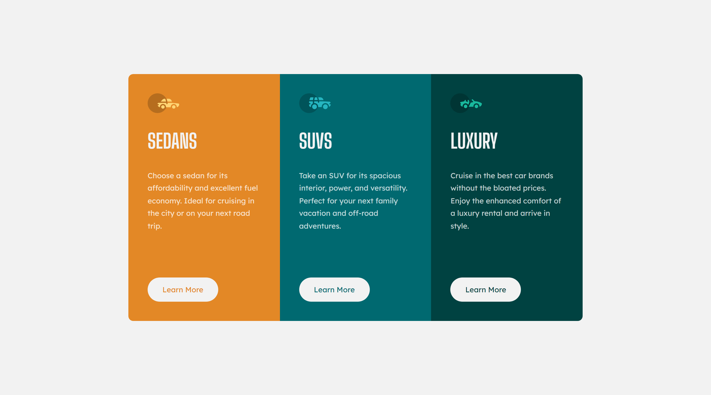

# Frontend Mentor - 3-column preview card component solution

This is a solution to the [3-column preview card component challenge on Frontend Mentor](https://www.frontendmentor.io/challenges/3column-preview-card-component-pH92eAR2-).  
Frontend Mentor challenges help you improve your coding skills by building realistic projects. 

\*Me\* : I agree 👍

## Table of contents

- [Overview](#overview)
  - [The challenge](#the-challenge)
  - [Screenshot](#screenshot)
  - [Links](#links)
- [My process](#my-process)
  - [What I learned](#what-i-learned)
- [Tools](#tools)
- [Author](#author)

## Overview

### The challenge

Users should be able to:

- View the optimal layout depending on their device's screen size
- See hover states for interactive elements

### Screenshot

### Links

- Solution URL: <https://your-solution-url.com>
- Live Site URL: <https://your-live-site-url.com>

## My process

I'm pretty glad the Flexbox Holy Albatross technique ever existed.

### What I learned

CSS is a **programming** language. Hail Heydon!

## Tools

- [Dev Docs](https://devdocs.io) - The resource I have been referring to throughout the process. It's an offline web app that has a huge collection of documentations.
- [Brackets](https://brackets.io) - My text editor. Not as powerful as VSCode, but still my favorite.
- Chrome - This web page was only tested on Chrome. 

## Author

- GitHub - [Mahdi Aljaza'iri](https://github.com/MahdiAljazairi)
- Frontend Mentor - [@MahdiAljazairi](https://www.frontendmentor.io/profile/MahdiAljazairi)
